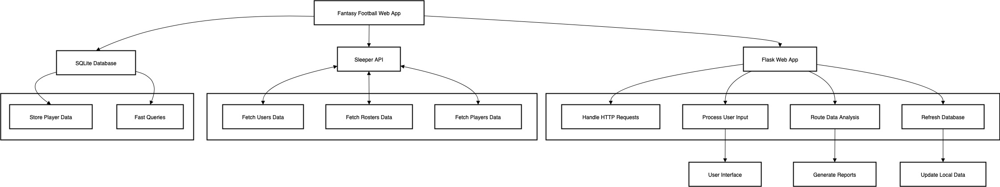

# Sleeper Fantasy Football api Final Project

## Deployment
**Heroku:** https://ffmvp-324c3a292859.herokuapp.com
**Gitlab:** https://github.com/davis4atuc/FFMVP

## Overview

This application is a Flask-based web service for analyzing fantasy football data using the Sleeper API. It allows users to:
- Retrieve roster and player information by username or player ID.
- Analyze team performance (Points For vs. Points Against).
- Refresh and store player data in a local SQLite database. (Sleeper limits calls to this large api response, best to refresh sparingly)
- Monitor service health and usage metrics.
- Integration with Github actions for Continious Integration builds and Heroku for Continious Deployments

## Architecture Diagram and Description

  


**Components:**
- **Flask Web App:** Handles HTTP requests, user input, and routes for data analysis and database refresh.
- **Sleeper API:** External public api for fantasy football data (users, rosters, players).
- **SQLite Database:** Stores player data locally for fast queries and because Sleeper limits player data api calls.
- **Prometheus Metrics endpoints:** Tracks request counts and exposes `/metrics` for prometheus formatted monitoring.

## Design Justifications

- **Flask:** Example provided in class, lightweight, easy to use for RESTful APIs and web forms.
- **SQLite (SQL Database):** Example provided in class, simple, local development, and easy integration with Flask. Relational data so chose relational database.
- **Prometheus Metrics:** Example provided in class, easy monitoring and integration with outside tools.
- **Modular Codebase:** Separation of concerns (API, database, metrics) improves maintainability and testability.
- **Github actions and Heroku:** Examples provided in classs and already configured.

## System Requirements

```bash
pip install -r requirements.txt
```
- Python 3.9+
- Flask
- Flask-SQLAlchemy
- prometheus_client
- Sleeper API access (slugaroo username can be used if you dont have one)